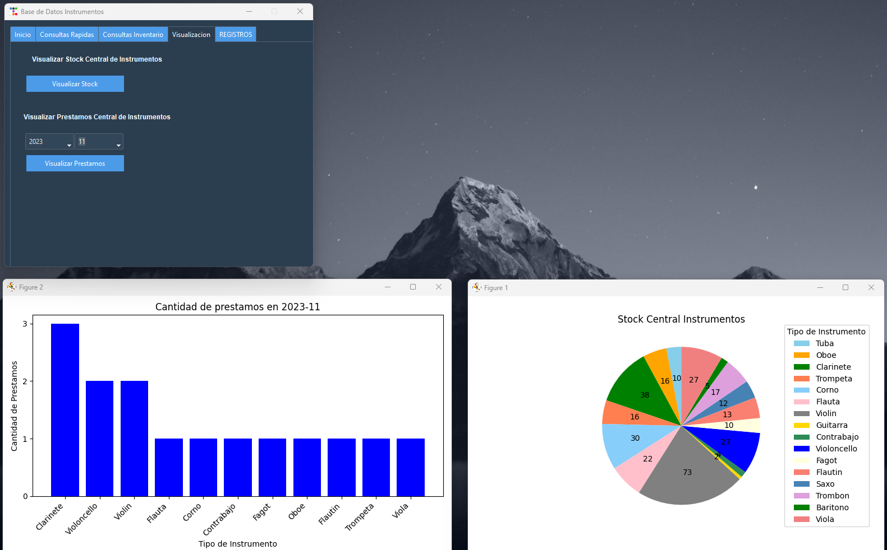
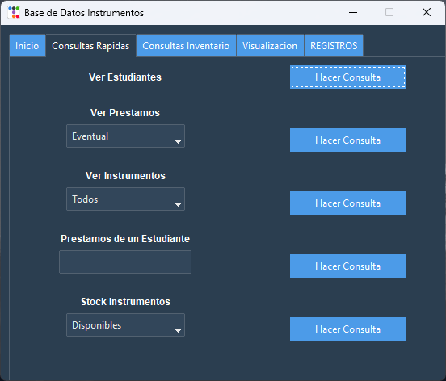

# BaseDatos1_uni
*** 
Relacionado a Asignatura Base de Datos 1 - uls.

#### Version_final.py -> Version que se entrega y presenta para (Hito 3) 
#### Instrumentos_DB.py -> Version con todas las funcionalidades. (Hito 4) 

 
 
 
 

  

  
SEM2 - 2023.
