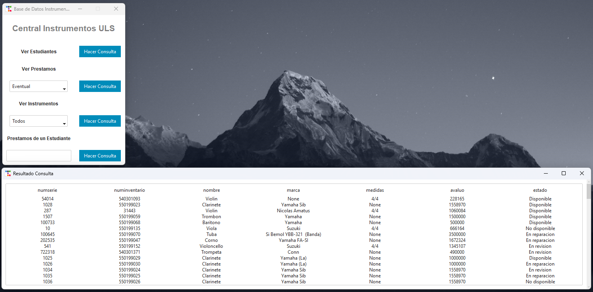

# BaseDatos1_uni
*** 
Relacionado a Asignatura Base de Datos 1 - uls.

#### Version_final.py -> Version que se va a entregar y presentar. (Hito 3) 
#### Instrumentos_DB.py -> Version con todas las funcionalidades. (Hito 4) {En Desarrollo} 

