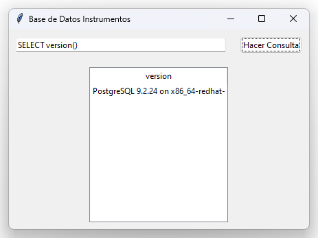
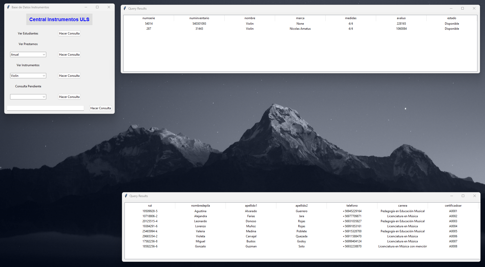

# BaseDatos1_uni
Relacionado a Asignatura Base de Datos 1 - uls.

Main.py es la version base (1ra foto).  
ventana.py version en progreso. 
test_combobox.py version en progreso. 
combinado.py- usa ventana.py con combobox.py 
 
Version_final.py es version que se va a entregar y presentar. (2da foto.)

 
 

